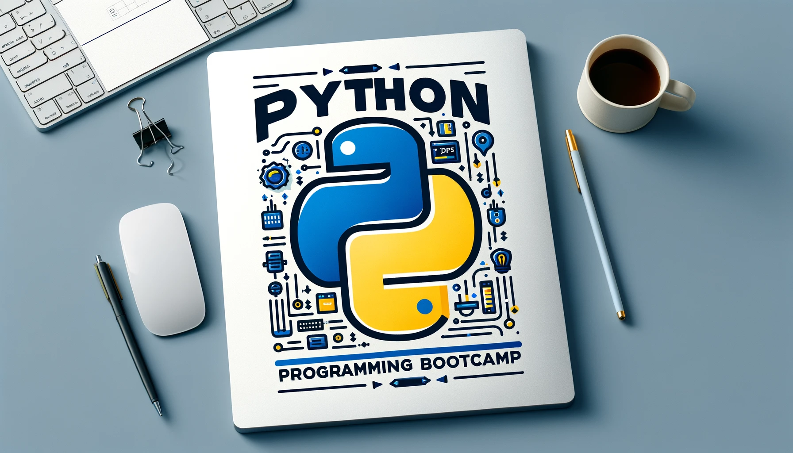

<h1 align="center">Desarrollo de Aplicaciones Full Stack Python Trainee</h1>

  

## Resumen
Este programa de formación está diseñado para desarrollar aplicaciones web Full Stack utilizando tecnología Python. El objetivo es solucionar las necesidades de la organización aplicando buenas prácticas de la industria y asegurando un producto de alta calidad. La duración total del programa es de 462 horas.

## Objetivo
Desarrollar competencias para la creación de aplicaciones web Full Stack en Python, cubriendo desde los fundamentos de desarrollo front-end hasta aspectos avanzados de programación y gestión de datos, preparando a los estudiantes para enfrentar desafíos reales en la industria.

## Módulos
1. **Orientación al Perfil y Metodología del Curso** 
2. **Fundamentos de Desarrollo Front-End** 
3. **Fundamentos de Programación en Python** 
4. **Programación Avanzada en Python** 
5. **Fundamentos de Bases de Datos Relacionales**
6. **Desarrollo de Aplicaciones Web con Python Django**
7. **Acceso a Datos en Aplicaciones Python Django**
8. **Desarrollo de Portafolio de un Producto Digital**
9. **Desarrollo de Empleabilidad en la Industria Digital** 

## Competencias a Desarrollar
- Implementación de páginas web básicas responsivas.
- Codificación de software en Python para diversas complejidades.
- Operación de bases de datos relacionales con SQL.
- Construcción de aplicaciones web con el patrón MVC usando Python/Django.
- Desarrollo de un portafolio digital y preparación para la inserción laboral en el sector tecnológico.

